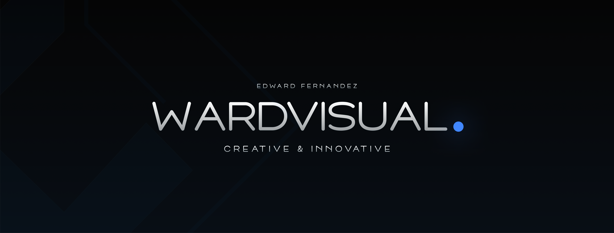

<!--
  @Author: Edward Fernandez (https://github.com/wardvisual)
 -->

### 👋 Hey, Great seeing you!

Hello, I'm Edward Fernandez🙋‍♂️, Full-Stack JS Developer based in the Philippines.

 
 

### Current Status Quo: ♨

- 🚀 A person who loves to make stuffs in his spare time and enhance his abilities with <strong>passion.<strong>
- 💼 Love working with Javascript stacks such as <strong>ReactJS, NodeJS and other stuffs</strong>.
- 📱 Currently learning Android App Development with <strong>Flutter<strong> and improving skills day by day.
- 🔍 I’m looking for connections in <strong>Web Development and UI/UX Designs</strong> Industry.
- 👁‍🗨 [Some of my world class UI designs | Behance][website]

### Connect with me: 💬

 

### Languages & Tools: 🛠💻

                               

 
 

### Github Trophies: 🏆

 
   

---

<!-- STAT THEMES (buefy, algolia, nightowl, dracula, vue, dark, onedark, prussian, radical, tokyonight) -->

### Github Activity: 🔥

---

### GitHub Highlights: :blossom:

  

 

_NOTE: Top languages do not indicate my skill level, it is a GitHub metric of which languages I have the most code on my repositories or in GitHub in general._

---

### Best UI Resources for front-end developers

---

[website]: https://www.behance.net/wardvisual
[twitter]: https://twitter.com/wardvisual
[instagram]: https://www.instagram.com/wardvisual/
[facebook]: https://www.facebook.com/wardvisual
