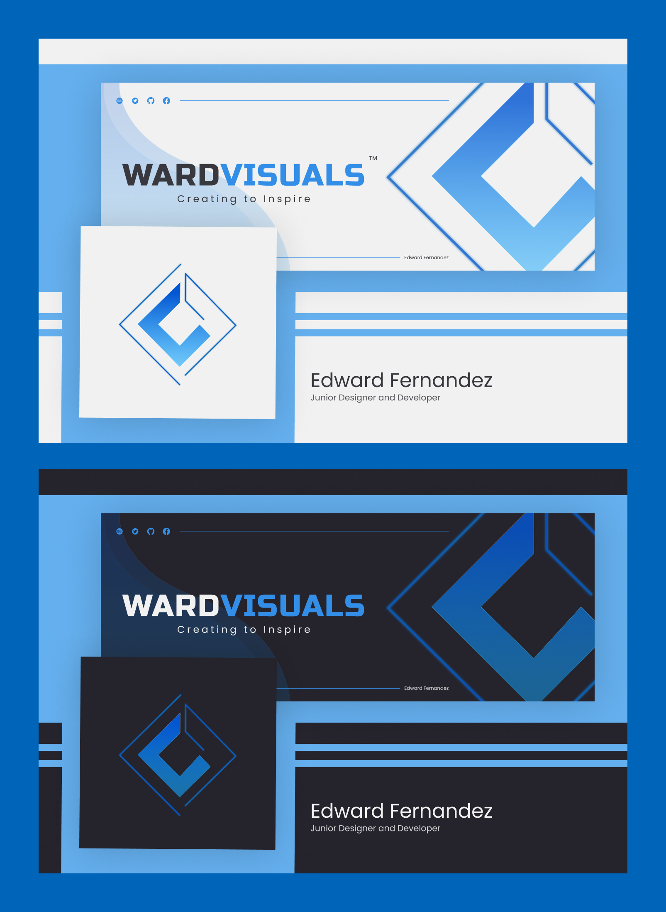

### Hi, Devs! 👋

 
[Edward Fernandez | Behance][website]

- 💠Push yourself to the limits.

### Connect with me:

[][twitter]
[][instagram]
[][facebook]

 

### Tools:

 

### Web Technologies:

<!--

-->

<!--  -->
<!-- webdevplaylist -->
<!-- -->
<!-- webdevplaylist -->
<!-- -->

 
 

---

<!-- STAT THEMES (buefy, algolia, nightowl, dracula, vue, dark, onedark, prussian, radical, tokyonight) -->

_NOTE: Top languages do not indicate my skill level, it is a GitHub metric of which languages I have the most code on my repositories or in GitHub in general._

---

### Best UI Resources for front-end developers

---

[website]: https://www.behance.net/wardvisual
[twitter]: https://twitter.com/wardvisual
[instagram]: https://www.instagram.com/wardvisual/
[facebook]: https://www.facebook.com/wardvisual
