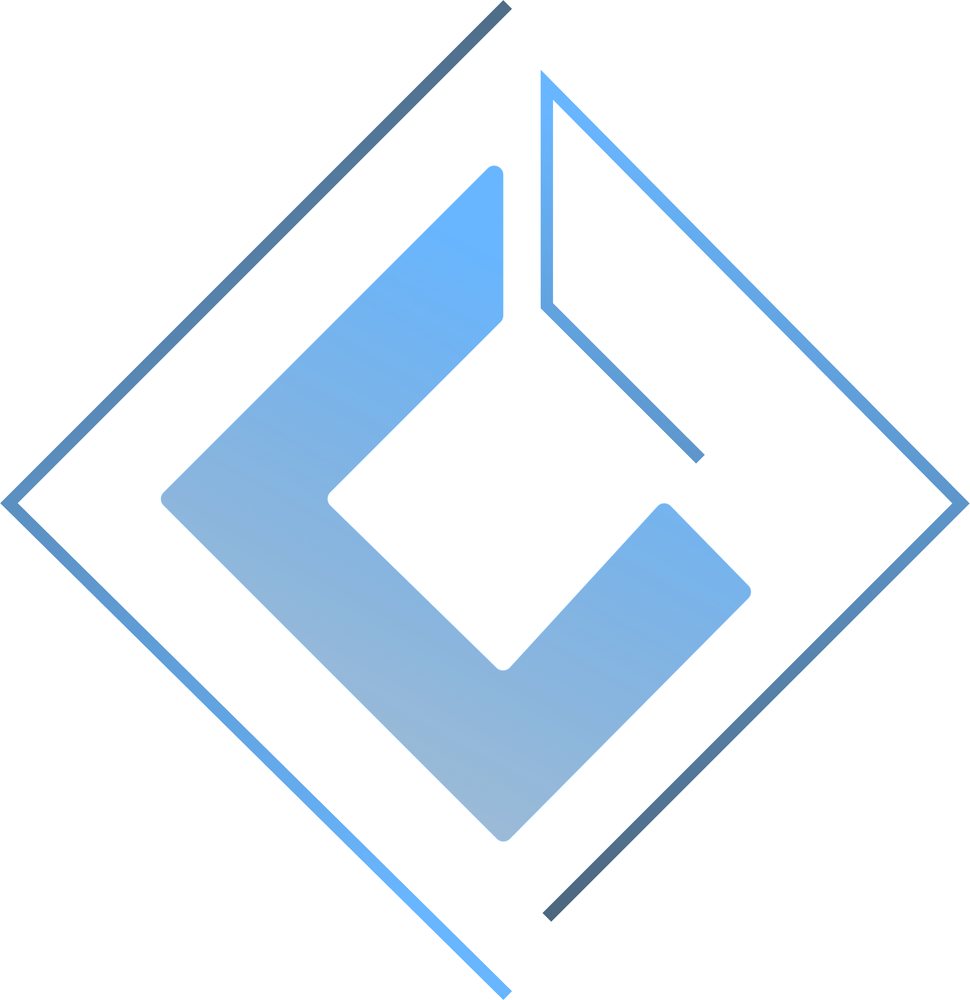

<main>
  

    <!-- Banner -->
    

        
        
    

    <!-- Introduction -->
    

        <h3 style="color: #5A9BDA;">Hey, Great seeing you! 👋🏻</h3>
        
 Hello, I'm Edward Fernandez. Full-Stack JS Developer based in the Philippines. 

    

    <!-- Badges -->
    

        
        
    

    <!-- About Me -->
    

       <ul style="list-style: none;">
            <li><h3 style="color: #5A9BDA;">About Me 🤷🏻‍♂️</h3></li>
            <li> 🚀 A person who loves to make stuffs in his spare time. </li>
            <li> 💼 JavaScript Enthusiast. I used Javascript Stacks to build an application. </li>
            <li> 🤖 45% Reading, 45% Coding, 10% Sleep. </li>
            <li> 🌱 Currently learning microservices development. </li>
            <li> 👯 Looking to collaborate on anything free and open source. </li>
            <li> 📫 How to reach me: @wardvisual </li>
       </ul>
    

  

</main>
